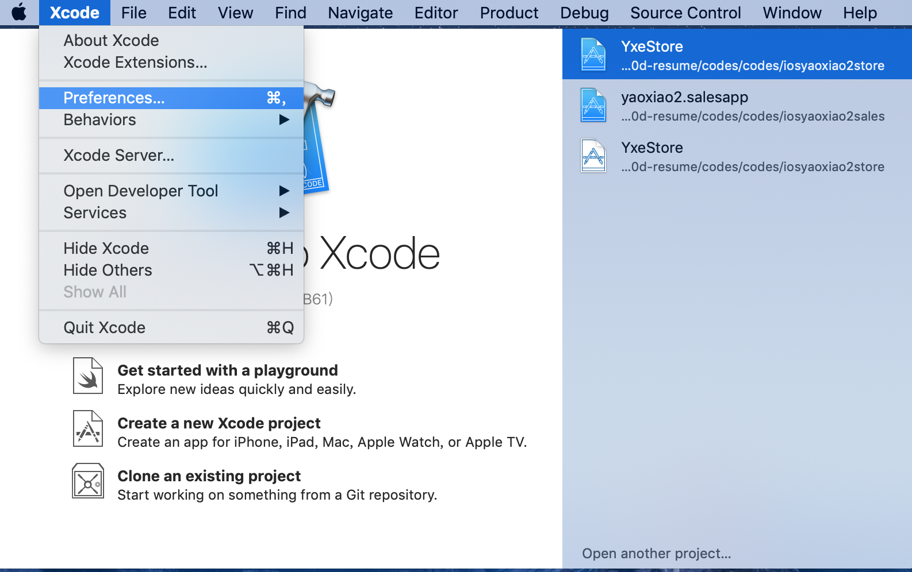
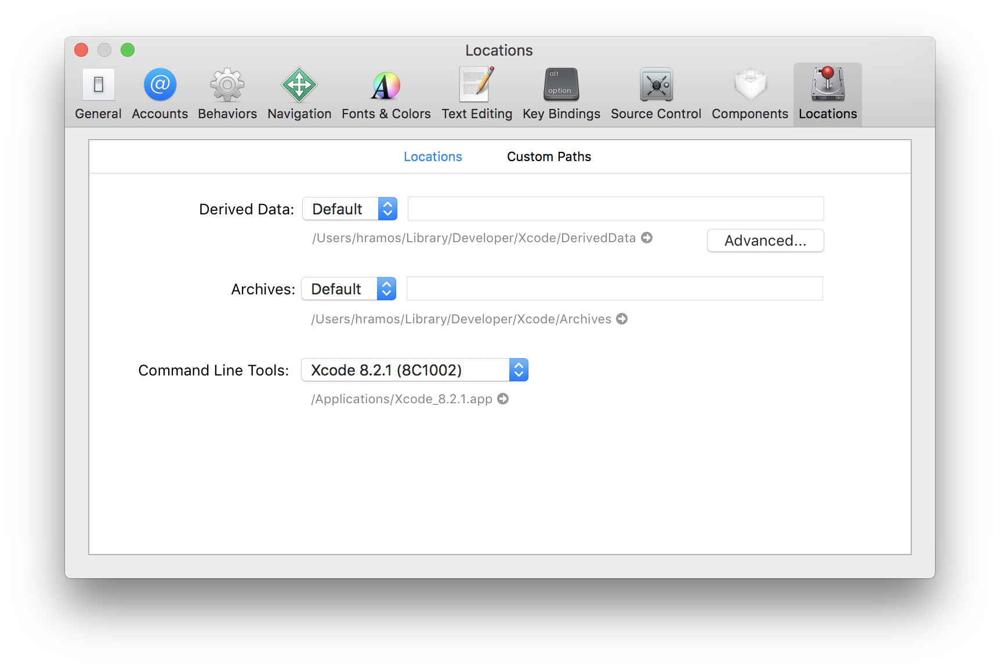
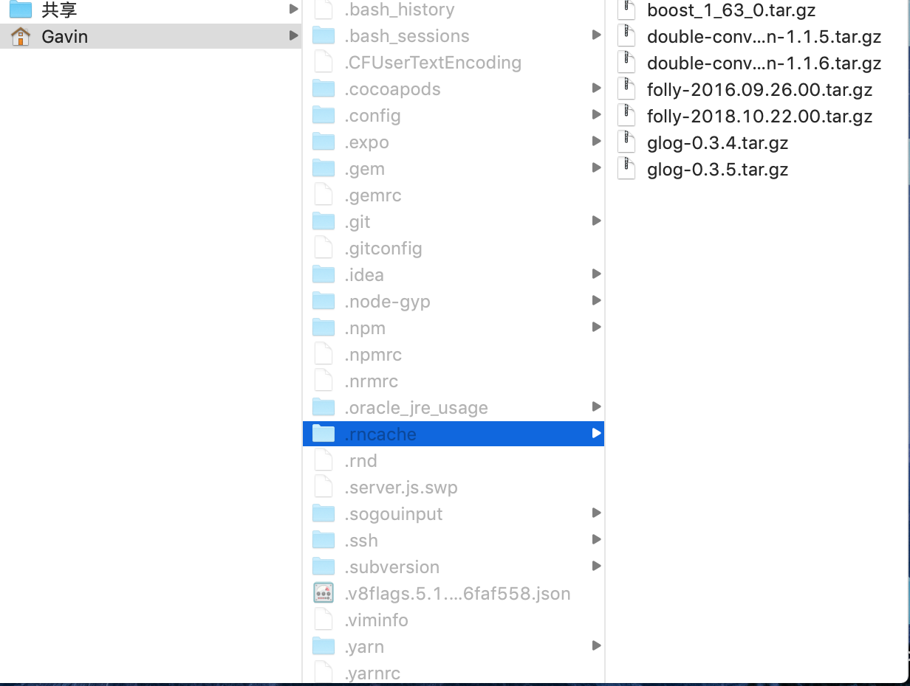
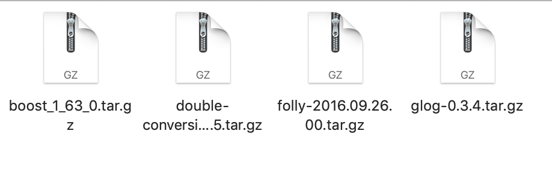

# Mac下搭建环境

## ios 安装流程

必须安装的tools有：Node、Watchman 和 React Native 命令行工具以及 Xcode

#### 1、安装 Homebrew

Mac系统的包管理器，用于安装NodeJS和一些其他必需的工具软件。

#### 2、确认 Node.js 是否已经安装

```
//  出现版本号成功安装
node -v
```

安装完 Node 后设置 npm 镜像用于加速后面的过程。

```
npm config set registry https://registry.npm.taobao.org --global
npm config set disturl https://npm.taobao.org/dist --global
```

*   nrm

nrm 是管理 npm 源切换的利器。

nrm 的安装

```
npm install -g nrm
```

nrm 的命令

```
//  列出来现在已经配置好的所有的原地址
nrm ls

//  切换到哪个源上
nrm use

//  add添加源
nrm

//  删除源
nrm del

//  测试源的响应时间，可以作为使用哪个源的参考
nrm test
```

示例：

```
nrm ls
 /*
    nrm ls 后可以打印如下：
    npm ---- https://registry.npmjs.org/
    * cnpm --- http://r.cnpmjs.org/
    taobao - http://registry.npm.taobao.org/
    nj ----- https://registry.nodejitsu.com/
    rednpm - http://registry.mirror.cqupt.edu.cn
    npmMirror  https://skimdb.npmjs.com/registry
 */

nrm use npm
```

#### 3、安装 Watchman

Watchman则是由 Facebook 提供的监视文件系统变更的工具。安装此工具可以提高开发时的性能（packager 可以快速捕捉文件的变化从而实现实时刷新）。

```
brew install watchman
```

#### 4、安装 Yarn

Yarn是 Facebook 提供的替代 npm 的工具，可以加速 node 模块的下载。React Native 的命令行工具用于执行创建、初始化、更新项目、运行打包服务（packager）等任务。

```
npm install -g yarn
```

安装完 yarn 后需要设置镜像源：

```
yarn config set registry https://registry.npm.taobao.org --global
yarn config set disturl https://npm.taobao.org/dist --global
```

#### 5、安装 Flow （选择安装）

Flow是一个静态的JS类型检查工具。译注：你在很多示例中看到的奇奇怪怪的冒号问号，以及方法参数中像类型一样的写法，都是属于这个flow工具的语法。这一语法并不属于ES标准，只是Facebook自家的代码规范（即不需要安装这一工具，也不建议去费力学习flow相关语法）。

```
brew install flow
```

#### 6、安装 Xcode

启动 Xcode，并在Xcode | Preferences | Locations菜单中检查一下是否装有某个版本的Command Line Tools。

如下图所示：





#### 7、创建、编译项目

*   注意：先安装 react-native-cli

React Native的命令行工具用于执行创建、初始化、更新项目、运行打包服务（packager）等任务。

```
npm install -g react-native-cli
```

a、使用 React Native 命令行工具来创建一个名为"MyApp"的新项目

```
react-native init MyApp
```

b、编译并运行 React Native 应用

```
cd MyApp
react-native run-ios
```

能看到 iOS 模拟器自动启动并运行项目，说明成功在 Mac下搭建环境。

## Mac缺少编译库编译失败

在使用 'react-native run-ios' 这条命令启动项目失败，很有可能是运行 'react-native init MyApp' 命令的时候，需要下载 boost 等几个第三方库编译。而这些库在国内即便翻墙也很难下载成功，导致无法运行iOS项目。

解决方案，如图所示：

*    需要先打开 Mac 下的隐藏目录，打开方式-> command键 + shift键 + 英语字母模式的 '.'

*    第一步，找到 .rncache 文件



*    第二步，第三方编译库复制到 .rncache 文件下



## Android 安装流程

#### 1、安装 Homebrew

Mac系统的包管理器，用于安装NodeJS和一些其他必需的工具软件。

#### 2、确认 Node.js 是否已经安装

#### 3、安装 Watchman

#### 4、安装 Yarn

#### 5、安装 Flow （选择安装）

Flow是一个静态的JS类型检查工具。译注：你在很多示例中看到的奇奇怪怪的冒号问号，以及方法参数中像类型一样的写法，都是属于这个flow工具的语法。这一语法并不属于ES标准，只是Facebook自家的代码规范（即不需要安装这一工具，也不建议去费力学习flow相关语法）。

#### 6、Java 安装

是否已经安装成功，可以运行' javac -version '来查看 JDK 版本。

#### 7、安装 Android SDK

> 配置 ANDROID_HOME 环境变量

*   注意点：Mac中找不到.bash_profile则需要创建.bash_profile文件

创建 .bash_profile 文件

a.输入cd ~/ 进入当前用户的home目录

b. 创建：touch .bash_profile

c.打开并编辑：open －e .bash_profile

d.保存关闭,其实创建了一个空文件

e.更新：source .bash_profile


#### 8、编译并运行 React Native 应用

参考资料react-native官网：https://facebook.github.io/react-native/