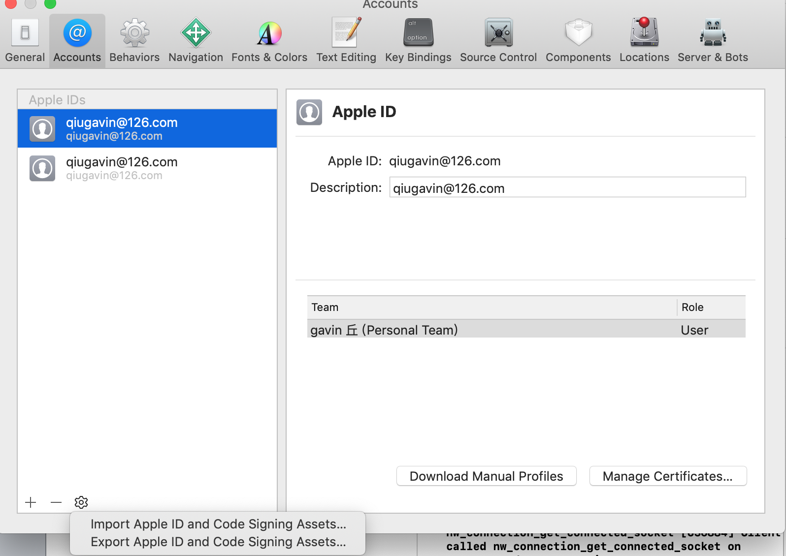

# iOS真机测试

<a href='https://reactnative.cn/docs/running-on-device/'>官方文档</a>  

## 通过 USB 数据线连接设备 

使用USB闪电数据线连接iOS设备到Mac。

## 打开文件

在 ios 文件夹里，然后用Xcode打开 .xcodeproj 文件，如果使用CocoaPods打开.xcworkspace。

## Xcode 登录账号

Xcode->preference->Accounts

## 配置代码签名

在Xcode Project导航中选择project，查找"General"标签。前往"Signing"并确保在"Team"下拉下选择了开发者账号或团队。

## 导出证书

打开Xcode-preferences-Accounts。

### 输入证书的密码，记住密码。

### 导出成功

## 导入证书

在桌面找到导出的文件

双击打开，提示输入密码， 密码就是前面你输入的密码

提示导入成功

## 设备信任证书

需要在手机里点击信任，打开设置-通用-描述文件与设备管理

## 选中测试的真机

点击当前选中的模拟设备即可展示所有设备，如下图，然后选中你的真机

## 编译并运行应用

如果一切设置正确，设备会在Xcode toolbar 中被列为build target，也会出现在设备面板里(⇧⌘2)。现在可以按下 Build and run 

按钮(⌘R)或从Product菜单中选择Run。app会立刻启动在设备上。

