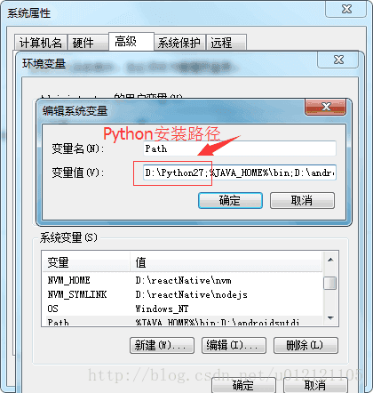
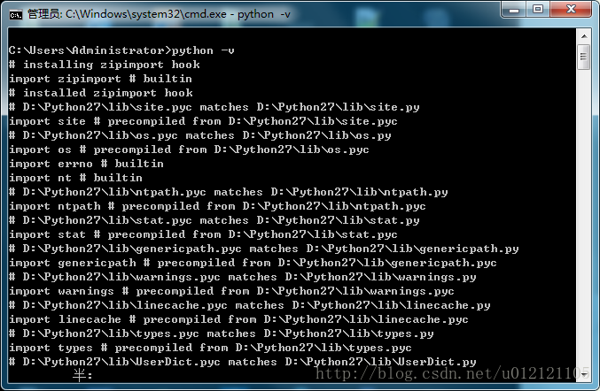
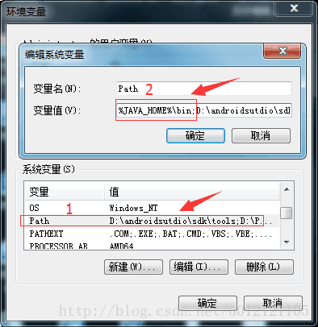
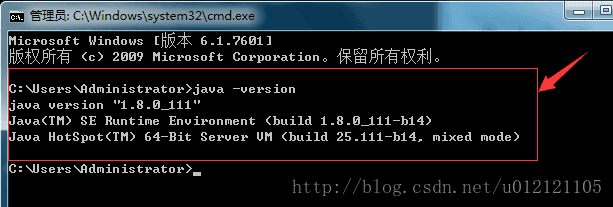
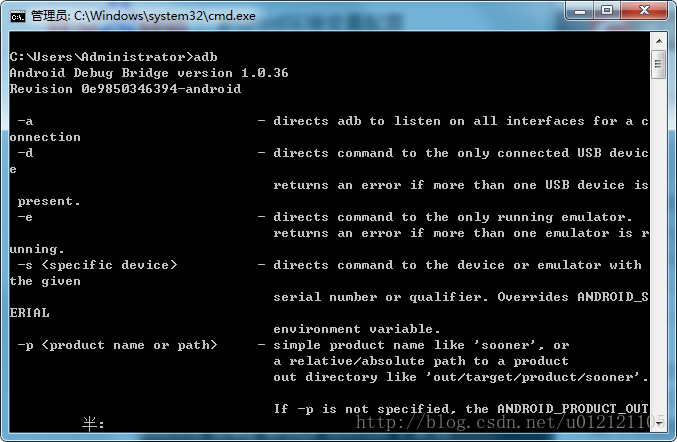
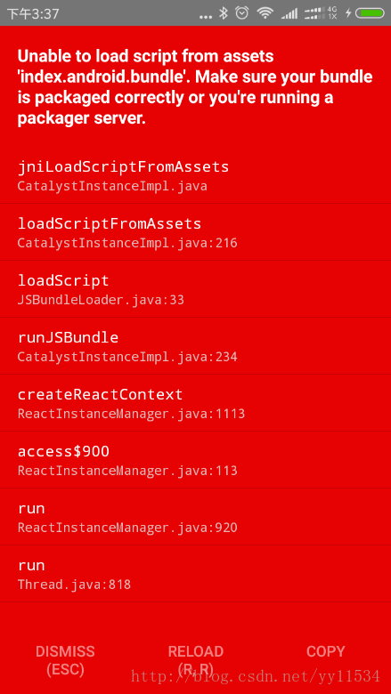

# Windows下搭建环境

React-Native中文网环境搭建<a href='https://reactnative.cn/docs/0.46/getting-started.html#content'>链接</a>

React-Native 环境搭建需要的步骤：

#### 1、安装 Homebrew

#### 2、确认 Node.js 是否已经安装

#### 3、安装 Watchman

#### 4、安装 Yarn

#### 5、安装 Flow （选择安装）

Flow是一个静态的JS类型检查工具。译注：你在很多示例中看到的奇奇怪怪的冒号问号，以及方法参数中像类型一样的写法，都是属于这个flow工具的语法。这一语法并不属于ES标准，只是Facebook自家的代码规范（即不需要安装这一工具，也不建议去费力学习flow相关语法）。

#### 6、安装Python

<a href='https://www.python.org/downloads/release/python-2713/'> Python 官网</a>

下载完后，双击安装 python-2.7.13.amd64.msi，安装完后，配置环境变量,在path的最前面添加python的安装路径，如图：



重打开cmd命令，输入python -v 后出现如下图则python 环境配置成功：



#### 7、Java 安装

<a href='http://www.oracle.com/technetwork/java/javase/downloads/jdk8-downloads-2133151.html'>下载地址</a>

成功安装后需要配置系统的环境变量，右击“计算机”–>”属性”–>”更改设置”–>”高级”–>”环境变量”。

点击系统变量的“ 新建”–>输入 JAVA_HOME以及jdk安装路径，如图：


在系统变量里找到Path,双击在变量值的最前面加上 %JAVA_HOME%\bin;后，点击确定。如图：



重打开cmd命令，输入 java -version 后出现如下图则java环境配置成功：



#### 8、安装 Android Studio

由于Android Studio包含了运行和测试React Native应用所需的Android SDK和模拟器。所以android studio安装。

<a href='https://developer.android.com/studio/index.html'>下载地址</a> 需要科学上网

<a href='http://www.runoob.com/android/android-studio-install.html'>android studio安装教程链接</a>

*  注意点

1、设置环境变量 ANDROID_HOME，右击“计算机”–>”属性”–>”更改设置”–>”高级”–>”环境变量”；

2、设置环境变量Path。

打开cmd命令，输入adb 后出现如下图则android 环境配置成功：



#### 9、安装 react-native-cli

React Native的命令行工具用于执行创建、初始化、更新项目、运行打包服务（packager）等任务。

cmd命令，输入：
```
npm install -g react-native-cli
```

如果成功的话，如下图所示：


#### 测试React-Native是否搭建好

主要下面三个命令初始化react-native项目并运行到android手机上。

1、react-native init MyApp

2、cd MyApp

3、react-native run-android

React-Native如果搭建好的话，会自动弹出下图：


# 搭建环境过程中问题记录

## 遇到的bug（一）



解决方案：进入项目，在android/app/src/main下新建assets目录；在编辑器的Terminal命令行中输入

```
react-native bundle --platform android --dev false --entry-file index.android.js --bundle-output app/src/main/assets/index.android.bundle --assets-dest app/src/main/assets
```

*  扩展：打离线包-原生RN命令打包

#### 离线包

离线包是把 ReactNative 和你写的 js文件、图片等资源都打包放入 App ，不需要走网络下载。

#### 打包命令说明

在进行原生开发时，我们可能需要在原生项目加载RN的代码，那么需要将RN项目打包成bundle文件，然后由原生对此引用。

使用打包命令来查看打包的具体参数

```
react-native bundle --help
```

react-native bundle + 参数 的形式构建 js 离线包

```
Options:
　　-h, --help 输出如何使用的信息
　　--entry-file <path> RN入口文件的路径, 绝对路径或相对路径
　　--platform [string] ios 或 andorid
　　--transformer [string] Specify a custom transformer to be used
　　--dev [boolean] 如果为false, 警告会不显示并且打出的包的大小会变小
　　--prepack 当通过时, 打包输出将使用Prepack格式化
　　--bridge-config [string] 使用Prepack的一个json格式的文件__fbBatchedBridgeConfig 例如: ./bridgeconfig.json --bundle-output <string> 打包后的文件输出目录, 例: /tmp/groups.bundle
　　--bundle-encoding [string] 打离线包的格式 可参考链接https://nodejs.org/api/buffer.html#buffer_buffer.
　　--sourcemap-output [string] 生成Source Map，但0.14之后不再自动生成source map，需要手动指定这个参数。例: /tmp/groups.map --assets-dest [string] 打包时图片资源的存储路径
　　--verbose 显示打包过程
　　--reset-cache 移除缓存文件
　　--config [string] 命令行的配置文件路径
　　--bundle-output bundle文件输出路径
　　--assets-dest 静态资源文件输出路径
```

## 遇到的bug（二）

有下文错误提示：

emulator: ERROR: x86 emulation currently requires hardware acceleration!
Please ensure Intel HAXM is properly installed and usable.
CPU acceleration status: HAX kernel module is not installed!

解决方案：

1、打开 Virtual technoly

需要在 BIOS 中的 Configuration (配置)中的 Virtual technoly 为Enable(打开)

进入BIOS的方法是，电脑重启时按住F2。

2、下载Intel HAXM 软件

<a href='https://blog.csdn.net/u012964796/article/details/46850461'>参考</a>
