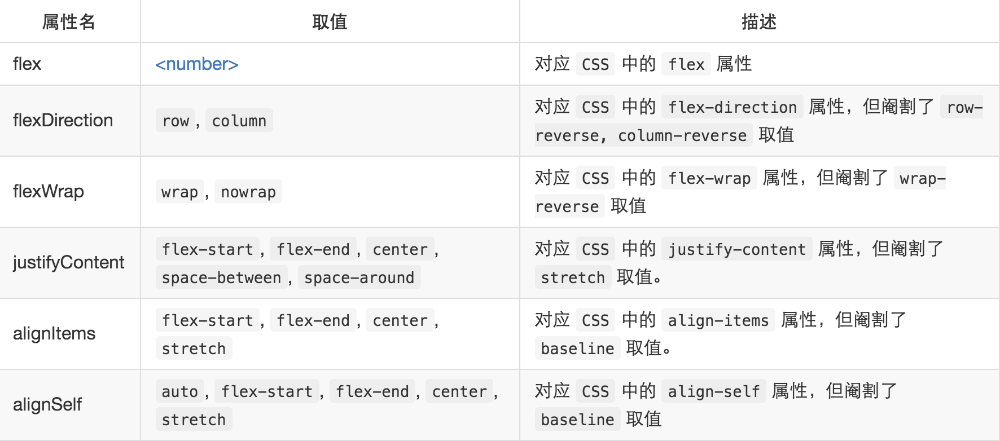

# React Native布局

react-native完全是用flex来实现，并且默认的flex布局为column布局。前端flex布局可以参考阮一峰老师的<a href='http://www.ruanyifeng.com/blog/2015/07/flex-grammar.html?utm_source=tuicool'>《flex布局：语法篇》</a>

react-native对flex某些属性值进行了舍弃，如下图：

### 概念

弹性容器（flex container）：可以理解为是父视图

弹性项目(flex item) ：可以理解为是子视图

主轴(main axis) ： 排列方向

侧轴/交叉轴(cross axis) ： 与排列方向垂直的方向

### 弹性容器的属性

flexDirection  ：控制主轴(main axis)的方向

flexWrap       ：是否换行

justifyContent :  子视图主轴(main axis)上的对齐方式

alignItems  ：子视图在交叉轴(cross axis)上如何对齐

alignSelf：item自己在交叉轴(cross axis)上的对齐方式，会覆盖默认的对齐方式

### rn样式与css样式的异同

View类似于DIV，会默认占用容器的100%的宽度

rn元素的绝对定位和相对定位不需要父元素设置position，且没有zIndex配置

不能以偏概全说rn的inline元素不能设置marginTop、marginBottom；
需要注意的是：包裹在View元素中的Text表现为block，可以设置margin和padding的各种属性；包裹在Text元素中的Text表现为inline元素，不能设置其marginTop和marginBottom， padding等用于block元素的属性

样式的继承只存在于Text元素内的Text元素，换句话说是Text元素里面的Text元素存在继承；继承的规则是子Text元素继承祖先Text和父Text元素的样式整合后的样式。

