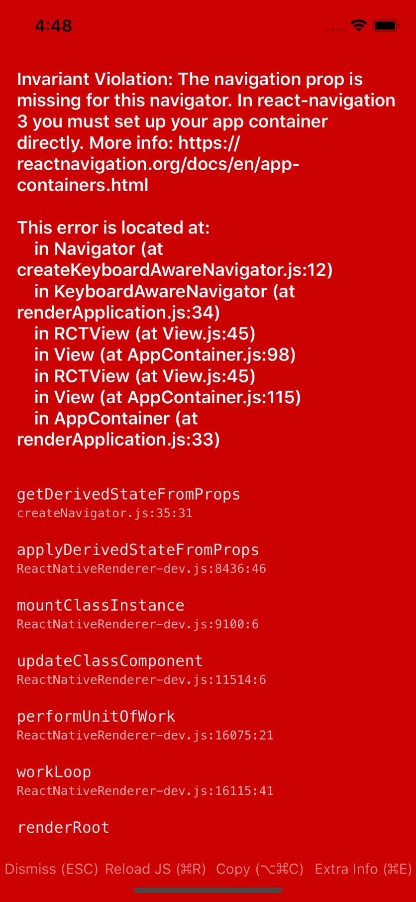
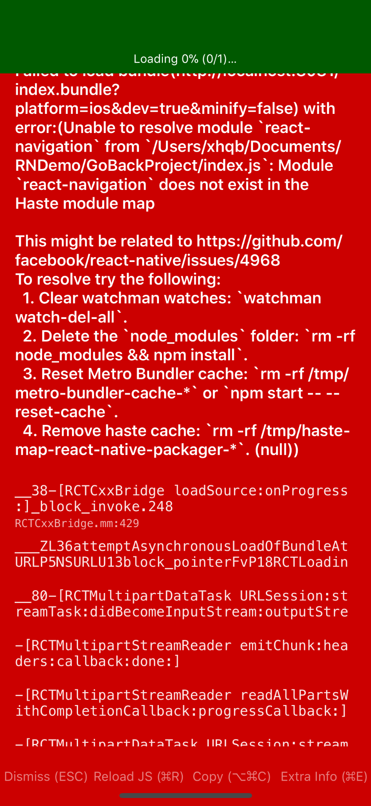
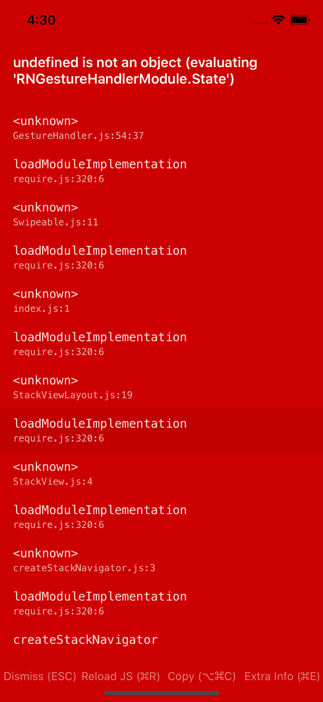

# React Native 报错问题



解决的方法：

````
import React from 'react';
import  {
    View,
    Text
} from 'react-native';
import {
    createBottomTabNavigator,
    createAppContainer
} from 'react-navigation';

class Home extends React.Component{
    render(): React.ReactElement<any> | string | number | {} | React.ReactNodeArray | React.ReactPortal | boolean | null | undefined {
        return (
            <View>
                <Text>home</Text>
            </View>
        );
    }
}

class More extends React.Component{
    render(): React.ReactElement<any> | string | number | {} | React.ReactNodeArray | React.ReactPortal | boolean | null | undefined {
        return (
            <View>
                <Text>More</Text>
            </View>
        );
    }
}

const TabNavigator = createBottomTabNavigator({
    Home: Home,
    More: More
});

const Container = createAppContainer(TabNavigator)

export default Container;
````




解决方案：
````
npm install --save react-navigation
````
可以参考官方 react-navigation 的<a href='https://reactnavigation.org/docs/en/getting-started.html'>安装</a>




解决方案：
````
remove node_modules and package-lock.json
npm install
npm install --save react-navigation
npm install --save react-native-gesture-handler
react-native link
````
