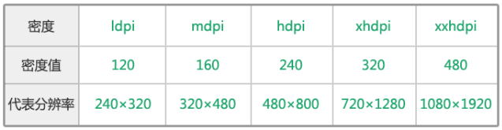

# 屏幕尺寸

## 基本概念

### 像素(px)
电子屏幕上组成一幅图画或照片的最基本单元。如果想象把屏幕不断放大，当可以看到一个个小点或者小方块的时候，小点或小方块就是像素。

### 物理像素

一个物理像素是显示器（手机屏幕）上最小的物理显示单元，

在操作系统的调度下，每一个设备像素都有自己的颜色值和亮度。

### pt
pt表示点，印刷行业常用单位，等于1/72英寸

### 屏幕密度(dpi)

一英寸多少个点，该值越高，则图片越细腻

### ppi

每英寸像素数，该值越高，则屏幕越细腻

### dp
设备在160DPI的时候，1个物理像素显示一个像素信息

160dpi，320 X 480 的设备，横向显示320个像素信息，1dp = 1px

320dpi,720 X 1280 的设备，横向显示360个像素信息，1dp = 2px

### sp
安卓开发用的字体大小单位。

### 分辨率

横纵两个方向的像素点的数量，常见取值480X800，320X480

### 屏幕尺寸

屏幕对角线的长度，电脑电视同理。

### 屏幕比例的问题

因为只确定了对角线长，2边长度还不一定，所以有了4：3，16：9这种，这样就可以算出屏幕边长。

### 设备独立像素

设备独立像素(也叫密度无关像素)，可以认为是计算机坐标系统中得一个点，
这个点代表一个可以由程序使用的虚拟像素(比如: css像素)，然后由相关系统转换为物理像素。

### density
密度，公式如下：
```
dp = （DPI/（160像素/英寸））px  =  density px
```

假如dpi是240 像素/英寸 ， 那么density就是 1.5，dp=1.5px

### 设备像素比

设备像素比(简称dpr)定义了物理像素和设备独立像素的对应关系。

```
//  在某一方向上，x方向或者y方向
设备像素比 = 物理像素 / 设备独立像素
```

例子：设备宽高为375×667，可以理解为设备独立像素(或css像素)。dpr为2，根据上面的计算公式，其物理像素应该×2，计算后为750×1334。

在javascript中，可以通过window.devicePixelRatio获取到当前设备的dpr。
在css中，可以通过-webkit-device-pixel-ratio，-webkit-min-device-pixel-ratio和 -webkit-max-device-pixel-ratio进行媒体查询，对不同dpr的设备，做一些样式适配(这里只针对webkit内核的浏览器和webview)。

### 位图像素

一个位图像素是栅格图像(如：png, jpg, gif等)最小的数据单元。每一个位图像素都包含着一些自身的显示信息(如：显示位置，颜色值，透明度等)。

理论上，1个位图像素对应于1个物理像素，图片才能得到完美清晰的展示。

在普通屏幕下是没有问题的，但是在retina屏幕下就会出现位图像素点不够，从而导致图片模糊的情况。

## 计算

### pt和px

```
1pt= (DPI / 72) px
```

新建画布的分辨率为72ppi( 即 72dpi时 )，1pt=1px；当新建画布分辨率为72*2=144ppi时，1pt=2px

### ppi和dpi

dpi最初用于衡量打印物上每英寸的点数密度。DPI值越小图片越不精细。当DPI的概念用在计算机屏幕上时，就应称之为ppi。同理： PPI就是计算机屏幕上每英寸可以显示的像素点的数量。因此，在电子屏幕显示中提到的ppi和dpi是一样的。
```
dpi=ppi
```

当我们把相同分辨率的图片，放在具有相同像素显示的屏幕上显示时，每一个像素，屏幕上对应一个点显示，此时DPI=PPI， 即我们把分辨率为m*n的图片，放在最大支持m *n像素的屏幕上时，DPI=PPI。

实际上，我们所需要显示图片的分辨率，跟屏幕参数匹配的概率还是很小的，不匹配时的情况。

把1280 x 720的图片，放在800 x 400的4英寸的屏幕与1920 x 1080的5.5英寸的屏幕上显示时的结果：


*  DPI=sqrt(1280^2+720^2)/5.5=267

PPI是屏幕的显示能力，所以跟显示的图片没有关系,只跟设备有关，是一个固定值；
DPI跟显示的图片有关系的。

a、1280x720分辨率的图片放在800x480的4英寸屏幕上的时候，虽然图片一行有720个像素，但是屏幕一行最多只能显示480个点，所以DPI=PPI=233，这时已经达到屏幕的最大显示能力。

b、1280x720分辨率的图片放在1920x1080的5.5英寸屏幕上的时候，虽然屏幕一行有1080个点，但是图片一行最多只能显示720个像素，所以DPI=293<PPI,并未达到屏幕的最大显示能力，屏幕未达到最佳显示。


### ppi计算方法

ppi是指屏幕上的像素密度

```
ppi= 屏幕对角线上的像素点数/对角线长度 = √ （屏幕横向像素点^2 + 屏幕纵向像素点^2）/对角线长度
```


上图表示这个手机的屏幕，计算后PPI表示每英寸最多显示293个像素点。

### px 和 dp

dp为安卓开发时的长度单位，根据不同的屏幕分辨率，与px有不同的对应关系.

安卓端屏幕大小各不相同，根据其像素密度，分为以下几种规格：



1dp定义为屏幕密度值为160ppi时的1px，即，在mdpi时，1dp = 1px。 以mdpi为标准，这些屏幕的密度值比为：ldpi : mdpi : hdpi : xhdpi : xxhdpi = 0.75 : 1 : 1.5 : 2 : 3；即，在xhdpi的密度下，1dp=2px；在hdpi情况下，1dp=1.5px。其他类推。

公式如下：
```
1dp=（屏幕ppi/ 160）px
```

该屏幕为480px*800px，按3.8寸屏算，点密度 √ (480^2 + 800^2) / 3.8 = 245，约等于240，对应于hdpi屏幕，所以该屏幕1dp=1.5px。

### dp和sp

dp和sp都是安卓的开发单位，dp是长度单位，sp是字体单位。sp与dp类似，但是可以根据用户的字体大小首选项进行缩放。Android系统允许用户自定义文字尺寸大小（小、正常、大、超大等等）。

当文字尺寸是“正常”时1sp=1dp，而当文字尺寸是“大”或“超大”时，1sp>1dp。

一般情况下 PT = DP = SP，不过iOS开发中长度用PT，安卓开发中长度用DP；iOS开发中字体的大小用PT，安卓开发中字体的大小用SP

由于做设计时以xhdpi为模板，xhdpi条件下，1dp=2px。若新建画布时，将画布分辨率设为144ppi，则1pt=2px=1dp。此时，即可将pt等同于dp。标注长度的时候，将长度像素除以2即为dp值。

PS：在photoshop cc中切图时，可直接在.png 图片图层名称前加上200%获得2倍大小的图，其他比例的切图以此类推。输出的两倍图不模糊的前提是，该图是photoshop中用形状工具画出来的未被栅格化的图形，而不是已被栅格化的图层或外部导入的图片。


<a href='http://www.html-js.com/article/Mobile-terminal-H5-mobile-terminal-HD-multi-screen-adaptation-scheme%203041'>博文推荐</a>