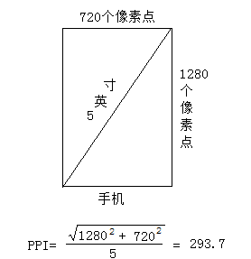
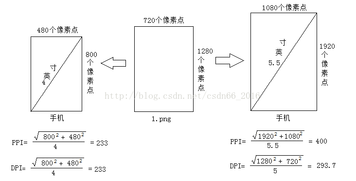

# 屏幕尺寸

## 定义

### 1、px
像素，电子屏幕上组成一幅图画或照片的最基本单元。

### 2、pt
pt表示点，印刷行业常用单位，等于1/72英寸

### 3、ppi

用来描述屏幕的像素显示密度，这个值越高，表示屏幕显示能力越强

PPI仅仅描述屏幕的显示能力，也不能描述任何图像的清晰度。

上图表示这个手机的屏幕，每英寸，最多显示293个像素点

### 4、dpi
DPI表示每英寸打印的点数，DPI才能表示图片清晰度。

### 5、dp
是安卓开发用的长度单位，1dp表示在屏幕像素点密度为160ppi时1px长度

### 6、sp
安卓开发用的字体大小单位。

### 7、分辨率

分辨率是用来描述图片的像素信息的，分辨率仅表示图片像素信息，不能表示任何关于图片清晰，清楚，质量高等的任何描述。

### 关联

当我们把相同分辨率的图片，放在具有相同像素显示的屏幕上显示时，每一个像素，屏幕上对应一个点显示，此时DPI=PPI， 即我们把分辨率为m*n的图片，放在最大支持m *n像素的屏幕上时，DPI=PPI。

实际上，我们所需要显示图片的分辨率，跟屏幕参数匹配的概率还是很小的，不匹配时的情况。

把1280*720的图片，放在800*400的4英寸的屏幕与1920*1080的5.5英寸的屏幕上显示时的结果：

*  DPI=sqrt(1280^2+720^2)/5.5=267

PPI是屏幕的显示能力，所以跟显示的图片没有关系,只跟设备有关，是一个固定值；
DPI跟显示的图片有关系的。

a、1280x720分辨率的图片放在800x480的4英寸屏幕上的时候，虽然图片一行有720个像素，但是屏幕一行最多只能显示480个点，所以DPI=PPI=233，这时已经达到屏幕的最大显示能力。

b、1280x720分辨率的图片放在1920x1080的5.5英寸屏幕上的时候，虽然屏幕一行有1080个点，但是图片一行最多只能显示720个像素，所以DPI=293<PPI,并未达到屏幕的最大显示能力，屏幕未达到最佳显示。

### 结论：

1、分辨率只能用来描述图片的像素信息，不能描述图片清晰度

2、PPI只能用来描述屏幕的显示密度，也不能描述图片的清晰度

3、DPI才能用来描述图片显示的清晰度，表示图片在屏幕上的显示效果。

4、当图片分辨率与屏幕显示像素相同时， DPI与PPI值相等

5、当图片分辨率大于屏幕显示像素时， DPI与PPI值相等，图片显示较差

6、当图片分辨率小于屏幕显示像素时， DPI值< PPI值相等，图片显示正常，屏幕未达到最佳显示效果。
